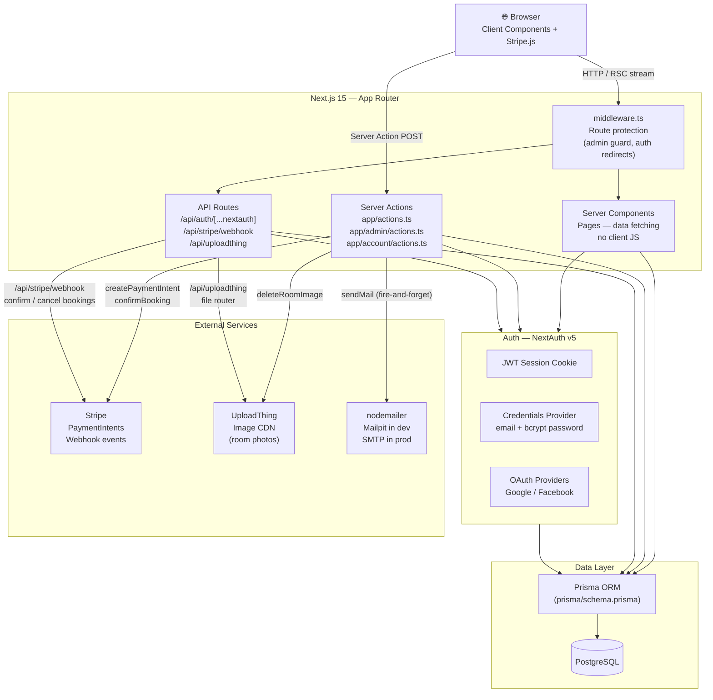
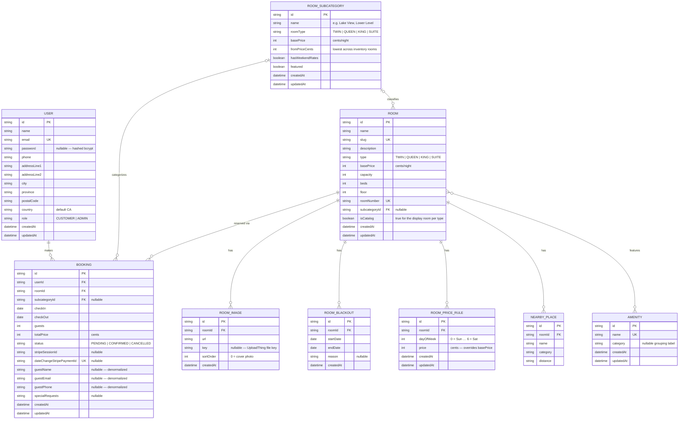

# Hôtel Levio — Architecture

## Backend Architecture

---

## Database Schema

---

## Key Design Decisions

| Decision | Rationale |
|---|---|
| Server Actions over REST API | Collocates mutation logic with the UI; no separate API layer to maintain for guest-facing flows |
| JWT sessions (not DB sessions) | Stateless; no `Session` table needed; works with edge middleware |
| Prices stored as integers (cents) | Eliminates floating-point rounding errors across pricing, Stripe, and display |
| Booking denormalizes guest fields | Preserves guest details at booking time; survives profile edits or account deletion |
| `isCatalog` flag on Room | One display room per type drives the homepage gallery; inventory rooms hold real floor/unit data |
| Cascade deletes on RoomImage, RoomBlackout, RoomPriceRule, NearbyPlace | Rooms can be deleted cleanly without orphaned records |
| `SetNull` on Booking → RoomSubcategory | Subcategory deletion does not cancel existing bookings |
